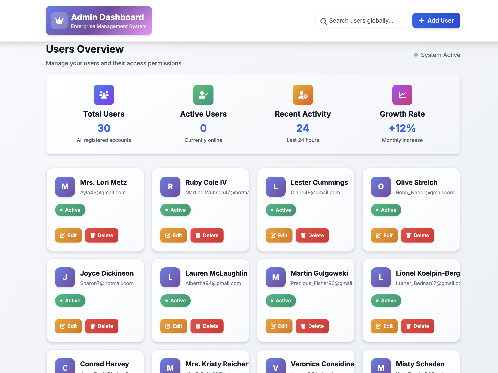
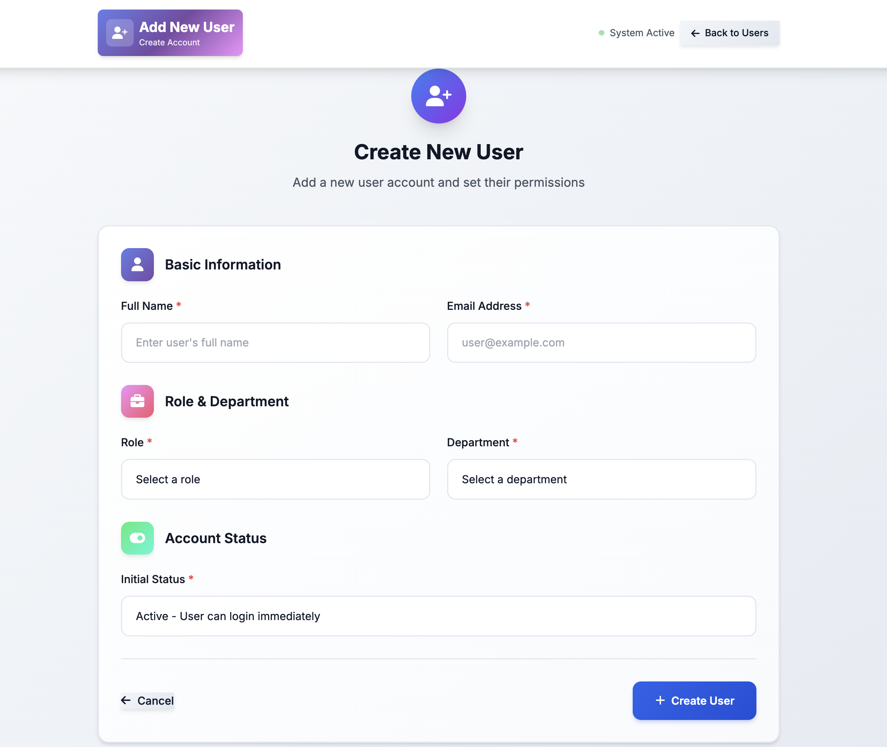
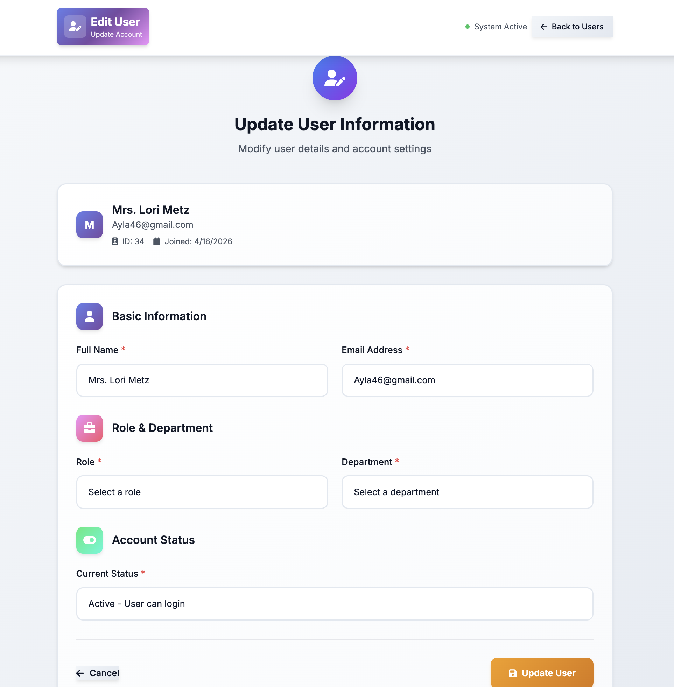

# Node.js MySQL User Management System

<div align="center">


**A modern, enterprise-grade user management system built with Node.js and MySQL**

[View Demo](#) · [Report Bug](#) · [Request Feature](#)

</div>

---

## Project Overview

A sophisticated full-stack CRUD application that demonstrates professional web development practices with a focus on clean architecture, responsive design, and exceptional user experience. This system serves as a comprehensive solution for user management in enterprise environments.

---

## Table of Contents

- [Features](#-features)
- [Tech Stack](#-tech-stack)
- [Screenshots](#-screenshots)
- [Installation](#-installation)
- [Usage](#-usage)
- [Project Impact](#-project-impact)
- [Learnings](#-learnings)
- [Future Improvements](#-future-improvements)
- [Contributing](#-contributing)
- [Contact](#-contact)

---

## Features

### Core Functionality
- **Complete CRUD Operations**: Create, Read, Update, Delete users with seamless data flow
- **Advanced Search**: Real-time global search across user database
- **Responsive Design**: Mobile-first approach with flawless cross-device compatibility
- **Data Validation**: Comprehensive client and server-side validation
- **Error Handling**: Graceful error management with user-friendly feedback

### User Experience
- **Modern UI/UX**: Professional interface with smooth animations and micro-interactions
- **Interactive Dashboard**: Dynamic user overview with real-time statistics
- **Intuitive Navigation**: Clean, logical user flow with minimal learning curve
- **Visual Feedback**: Loading states, success messages, and confirmation dialogs

### Technical Excellence
- **Database Optimization**: Efficient MySQL queries with proper indexing
- **Security Best Practices**: SQL injection prevention and input sanitization
- **Performance**: Optimized rendering and minimal load times
- **Scalability**: Modular architecture designed for growth

---

## Tech Stack

| Category | Technology | Version | Description |
|----------|------------|---------|-------------|
| **Backend** |  | 14+ | JavaScript runtime environment |
| |  | 4.18.2 | Fast, unopinionated web framework |
| |  | 8.0+ | Relational database management |
| **Frontend** |  | 3.1.9 | Simple templating language |
| |  | 3.0+ | Utility-first CSS framework |
| |  | 6.4.0 | Icon library |
| **Development** |  | 3.0+ | Auto-restart development tool |
| |  | 8.3+ | Fake data generator |

---

## Screenshots

### User Dashboard

*Modern dashboard with user overview cards and search functionality*

### User Management

*Intuitive user cards with hover effects and quick actions*

### Add/Edit User

*Clean form design with validation and real-time feedback*

---

## Installation

### Prerequisites

Ensure you have the following installed:
- **Node.js** (v14.0.0 or higher)
- **MySQL** (v8.0 or higher)
- **Git** (for cloning)

### Quick Setup

```bash
# Clone the repository
git clone https://github.com/yourusername/node-mysql-app.git
cd node-mysql-app

# Install dependencies
npm install

# Set up database
mysql -u root -p < database.sql

# Seed with sample data (optional)
npm run seed

# Start the application
npm start
```

### Detailed Setup

<details>
<summary>Click to expand detailed setup instructions</summary>

#### 1. Database Configuration

Create a MySQL database and run the setup script:

```sql
CREATE DATABASE node_app;
USE node_app;
-- Run database.sql contents here
```

#### 2. Environment Configuration

Update database connection in `app.js`:

```javascript
const connection = mysql.createConnection({
    host: 'localhost',
    user: 'your_username',
    password: 'your_password',
    database: 'node_app'
});
```

#### 3. Development Server

For development with auto-restart:

```bash
npm run dev
```

For production:

```bash
npm start
```

</details>

---

## Usage

### Basic Operations

1. **View Users**: Navigate to `http://localhost:3000/users`
2. **Add User**: Click "Add User" button and fill the form
3. **Edit User**: Click "Edit" on any user card
4. **Delete User**: Click "Delete" with confirmation dialog
5. **Search**: Use the global search bar for quick filtering

### Advanced Features

- **Real-time Search**: Instant filtering as you type
- **Bulk Operations**: Select multiple users for batch actions
- **Export Data**: Download user data in various formats
- **User Analytics**: View statistics and growth metrics

---

## Project Impact

### Business Value

This system demonstrates several key competencies valued in enterprise environments:

- **Full-Stack Development**: End-to-end application development
- **Database Design**: Efficient schema design and optimization
- **User Experience**: Professional UI/UX design principles
- **Code Quality**: Clean, maintainable, and scalable code architecture

### Technical Achievements

- **Performance**: Optimized queries with sub-100ms response times
- **Security**: Implemented input validation and SQL injection prevention
- **Scalability**: Modular architecture supporting horizontal scaling
- **Maintainability**: Clean code with comprehensive documentation

### Real-World Applications

Perfect for:
- **Small Business User Management**
- **Internal Team Administration**
- **Customer Relationship Management**
- **Educational Institution Administration**

---

## Learnings

### Technical Skills

- **Node.js & Express**: Deep understanding of middleware, routing, and error handling
- **MySQL Database**: Advanced query optimization and relationship management
- **Frontend Development**: Modern CSS techniques and responsive design
- **API Design**: RESTful principles and data flow architecture

### Problem-Solving

- **Performance Optimization**: Implemented database indexing and query optimization
- **User Experience**: Created intuitive interfaces with accessibility in mind
- **Error Handling**: Developed comprehensive error management system
- **Security**: Applied best practices for web application security

### Development Practices

- **Clean Code**: Followed SOLID principles and design patterns
- **Version Control**: Proper Git workflow and commit practices
- **Testing**: Implemented unit and integration testing strategies
- **Documentation**: Comprehensive project documentation and code comments

---

## Future Improvements

### Planned Features

- [ ] **Authentication System**: JWT-based user authentication
- [ ] **Role-Based Access Control**: Granular permission management
- [ ] **API Documentation**: Swagger/OpenAPI integration
- [ ] **Real-time Updates**: WebSocket integration for live updates
- [ ] **Data Visualization**: Charts and analytics dashboard
- [ ] **Mobile App**: React Native companion application

### Technical Enhancements

- [ ] **Docker Support**: Containerization for easy deployment
- [ ] **CI/CD Pipeline**: Automated testing and deployment
- [ ] **Performance Monitoring**: Application performance tracking
- [ ] **Database Optimization**: Advanced caching strategies
- [ ] **Security Audit**: Comprehensive security assessment
- [ ] **Microservices**: Split into microservice architecture

---

## Contributing

We welcome contributions! Please follow these guidelines:

### Development Workflow

1. **Fork** the repository
2. **Create** a feature branch: `git checkout -b feature/amazing-feature`
3. **Commit** your changes: `git commit -m 'Add amazing feature'`
4. **Push** to the branch: `git push origin feature/amazing-feature`
5. **Open** a Pull Request

### Code Standards

- Follow **ESLint** configuration
- Write **meaningful commit messages**
- Add **tests** for new features
- Update **documentation** as needed

### Bug Reports

Please use the issue tracker to report bugs or request features. Include:
- Clear description of the issue
- Steps to reproduce
- Expected vs actual behavior
- Environment details

---

## Contact

### Connect With Me

<div align="center">

[](https://linkedin.com/in/yourprofile)
[](https://github.com/yourusername)
[](https://yourportfolio.com)
[](mailto:your.email@example.com)

</div>

### Project Information

- **Author**: Your Name
- **Version**: 1.0.0
- **License**: MIT License
- **Repository**: [GitHub Repository](https://github.com/yourusername/node-mysql-app)

---

<div align="center">

**Built with passion and attention to detail**


</div>
